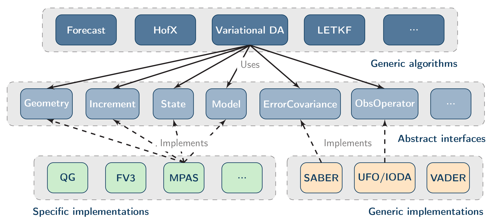
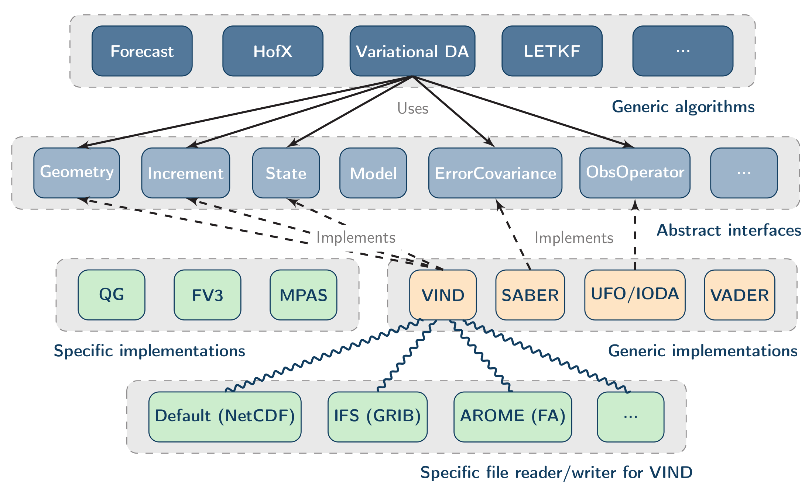

# VIND

### Licence

(C) Copyright 2025 Meteorologisk Institutt

[](https://opensource.org/licenses/Apache-2.0)

### Description

VIND (Versatile Implementation for Native Data), formerly known as QUENCHXX, is a generic ATLAS-based model interface for OOPS.

JEDI framework:
- Project webpage: [jcsda.org](https://www.jcsda.org/jcsda-project-jedi)
- Documentation: [readthedocs](https://jointcenterforsatellitedataassimilation-jedi-docs.readthedocs-hosted.com/en/latest/)

JEDI structure:



JEDI structure with VIND:



Available specific file readers/writers:
- Default from OOPS (NetCDF)
- AQ (NetCDF)
- AROME (FA / NetCDF)
- BSC (NetCDF)
- GMSH
- GRIB

### Installation

Store the current vind source directory in `VIND_SRC`.  
Create a compilation directory (store its path in `VIND_BUILD`) and an installation directory (store its path in `VIND_INSTALL`).  
Change directory to the compilation directory:
``` shell
cd ${VIND_BUILD}
```
Invoke `ecbuild` 

``` shell
ecbuild --prefix=${VIND_BUILD} --build='Release' -DCMAKE_INSTALL_PREFIX=${VIND_INSTALL} -DENABLE_OMP="ON" ${VIND_SRC}/bundle
```

N.B. extra definitions could be needed.  
Here an example for providing custom paths for some libraries and activating extra tests.  

``` shell
ecbuild --prefix=${VIND_BUILD} --build='Release' -DCMAKE_INSTALL_PREFIX=${VIND_INSTALL} -DENABLE_MONARCH_TESTS="ON" -DENABLE_LORENZ95_MODEL=OFF -DENABLE_OOPS_DOC="OFF" -DENABLE_OMP="ON" -DNetCDF_Fortran_INCLUDE_DIR=${NETCDFF_INCDIR} -Dudunits_INCLUDE_DIR=/usr/include/udunits2 ${VIND_SRC}/bundle
```

